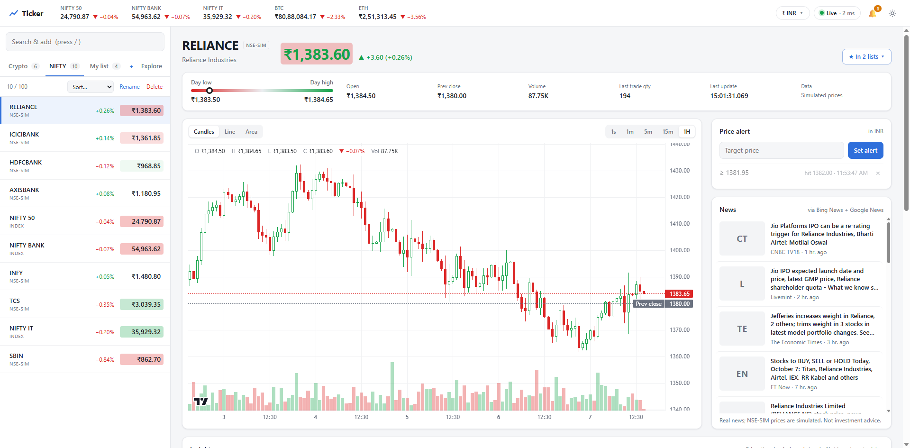

# Ticker

A real-time market-data dashboard that works the way Zerodha Kite and Groww push live
prices. A Go server streams prices to the browser over a compact binary WebSocket protocol,
and a SolidJS frontend renders them with sub-millisecond update cost.



> **Not investment advice.** This is a technology demonstration. Crypto prices are real
> (Binance). **NSE prices are simulated** and labelled `NSE-SIM`. News headlines are real. The
> Insights section is educational and rule-based; it never makes buy/sell recommendations.

## Features

**Live prices**
- Real-time streaming over a binary WebSocket, using a Kite-style protocol (12-byte LTP / 68-byte
  full packets) with flashing price changes.
- **Dynamic crypto universe.** The top 100 USDT pairs on Binance by 24h volume, re-ranked every 30
  minutes. Newly popular pairs appear without a page reload, and stablecoin pairs are filtered out.
- 109 simulated NSE stocks plus 3 indices (NIFTY 50, NIFTY BANK, NIFTY IT), calculated from their
  member stocks.
- Optional US stocks via Finnhub (free API key).

**Watchlists and alerts**
- Multiple named watchlists: create, rename, delete, drag to reorder (mouse and touch) or
  Alt+↑/↓, one-shot sort.
- Ranked search (press `/`) and an Explore view with category filters.
- Price alerts with toasts and desktop notifications.

**Charts and analysis**
- Candlestick, line and area charts at 1s, 1m, 5m, 15m and 1H, with volume and an OHLC readout.
  Crypto history is real (Binance); NSE-SIM history is synthetic.
- Key stats, day-range bar, top movers and an index heatmap.
- News per instrument, with thumbnails. New headlines pop in live.
- **Insights:** trend, momentum (RSI), volatility, performance, volume activity and news tone,
  each explained in plain English, plus a position-size calculator.

**Experience**
- Display currency auto-detected from your location (₹ INR in India), or pick from 11
  currencies.
- Light, dark and system themes. A colourblind-safe palette (blue/orange).
- Responsive from phone (390 px) to desktop.

**Engineering**
- Conflated fan-out: each quote is encoded once per frame for all clients; slow clients skip
  frames, so memory stays bounded.
- Hardened: strict CSP, per-IP rate limits, WebSocket origin checks, an SSRF-safe image proxy, and
  panic recovery. See [SECURITY.md](SECURITY.md).
- Tested at 5,000 concurrent connections on one machine. See [docs/DESIGN.md](docs/DESIGN.md).

## Quick start

### Prerequisites
- **Go 1.26.6+** (older toolchains auto-download the pinned version)
- **Node.js 20+** and npm
- Internet access, for Binance, news and exchange rates. No API keys are needed.

### Option A: one server (simplest)

```bash
# 1. Build the frontend
cd frontend
npm install
npm run build

# 2. Run the server, which also serves the built UI
cd ../backend
STATIC_DIR=../frontend/dist go run ./cmd/server
```

Open **http://localhost:8080**.

On Windows PowerShell, set the variable first:
```powershell
cd backend
$env:STATIC_DIR = "..\frontend\dist"; go run ./cmd/server
```

### Option B: development (hot reload)

```bash
# Terminal 1: API and WebSocket on :8080
cd backend
go run ./cmd/server

# Terminal 2: Vite dev server on :5173, proxying /api and /ws to :8080
cd frontend
npm install
npm run dev
```

Open **http://localhost:5173**.

### Build a binary

```bash
cd backend
go build -o ticker ./cmd/server        # ticker.exe on Windows
STATIC_DIR=../frontend/dist ./ticker
```

The server is stateless. To roll back, redeploy the previous binary; clients reconnect and
resubscribe on their own.

## Configuration

All settings are environment variables. The defaults work out of the box.

**Core**

| Variable | Default | Purpose |
|---|---|---|
| `ADDR` | `:8080` | Listen address |
| `STATIC_DIR` | — | Folder with the built frontend (`frontend/dist`) |
| `FEEDS` | `binance,sim` | Any of `binance`, `sim`, `finnhub` |
| `FLUSH_MS` | `50` | Update cadence. Higher values use less bandwidth |
| `MAX_SUBS` | `3000` | Max instruments per connection |
| `MAX_CLIENTS` | `20000` | Max concurrent connections |

**Market data**

| Variable | Default | Purpose |
|---|---|---|
| `BINANCE_TOP` | `100` | Stream the top N USDT pairs by 24h volume (max 500). `0` = only `BINANCE_SYMBOLS` |
| `BINANCE_SYMBOLS` | — | Pairs always included, e.g. `BTCUSDT,ETHUSDT` |
| `BINANCE_REFRESH_MIN` | `30` | How often the top-N ranking is refreshed |
| `SIM_TPS` | `500` | Simulated NSE ticks per second |
| `FINNHUB_TOKEN` / `FINNHUB_SYMBOLS` | — | Enables US stocks (free key from finnhub.io) |

**Security and deployment.** These are documented in full in [SECURITY.md](SECURITY.md).

| Variable | Default | Purpose |
|---|---|---|
| `ALLOWED_ORIGINS` | `localhost:5173,127.0.0.1:5173` | Extra WebSocket origins. **Set to your domain in production** |
| `TRUST_PROXY` | `false` | Trust `X-Forwarded-For`. Enable **only** behind ALB/CloudFront |
| `HSTS` | `false` | Enable behind an HTTPS load balancer |
| `TLS_CERT_FILE` / `TLS_KEY_FILE` | — | Serve HTTPS directly |
| `RATE_LIMIT` | `on` | `off` only for load tests |

## Architecture

```
 Binance (real) ─┐                 Go server                              Browser (SolidJS)
 NSE simulator ──┼─► feeds ─► hub ─► encode changed quotes once ─► WS ─► decode ─► 1 paint/frame
 Finnhub (opt) ──┘            │      every 50 ms (conflation)          │
                              ├─► candles (1m/5m/15m/1h) ──────────────┤  REST: candles, news,
 Bing/Google/Yahoo news ──────┼─► news + insights (cached) ────────────┤  insights, FX, quotes
 ECB exchange rates ──────────┴─► FX rates (hourly) ───────────────────┘
```

| Document | What's inside |
|---|---|
| [docs/HOW-IT-WORKS.md](docs/HOW-IT-WORKS.md) | Every feature step by step: data flow, watchlists, alerts, charts, currency, news, insights |
| [docs/DESIGN.md](docs/DESIGN.md) | Broker analysis, stack choice (Go + SolidJS), performance decisions, load-test results, wire protocol |
| [SECURITY.md](SECURITY.md) | Threat model, controls, configuration, and what's required before handling accounts or orders |

### Project structure

```
backend/
  cmd/server/        HTTP + WebSocket server, routes, security middleware
  cmd/loadtest/      Load generator (thousands of WebSocket clients)
  internal/hub/      Quote table, conflated frame builder, per-client writers
  internal/proto/    Binary wire format
  internal/feed/     Binance (dynamic universe), NSE simulator, Finnhub
  internal/candles/  OHLCV aggregation + history backfill
  internal/news/     News sources, relevance filter, image proxy
  internal/insights/ Rule-based signals (descriptive, not advice)
  internal/fx/       Exchange rates
frontend/src/
  lib/               Feed client, watchlists, alerts, currency, theme, formatting
  components/        Dashboard UI
docs/                Design and feature documentation
```

### HTTP API

| Endpoint | Returns |
|---|---|
| `GET /ws` | WebSocket price stream (protocol in [docs/DESIGN.md](docs/DESIGN.md#6-wire-protocol)) |
| `GET /api/instruments` | Instrument catalog. Supports `ETag`/`If-None-Match` (the list grows at runtime) |
| `GET /api/quotes` | Compact snapshot of all prices |
| `GET /api/candles?token=&interval=1m\|5m\|15m\|1h&limit=` | OHLCV history |
| `GET /api/news?token=` | Recent headlines |
| `GET /api/insights?token=` | Educational signals |
| `GET /api/fx` | Display exchange rates (USD base) |
| `GET /api/stats` | Server throughput |
| `GET /healthz` | Liveness |

## Testing

```bash
# Backend: unit + integration tests (hub, protocol, feeds, candles, news, insights, security)
cd backend && go test ./...

# Vulnerability scans
cd backend && go run golang.org/x/vuln/cmd/govulncheck@latest ./...
cd frontend && npm audit

# Frontend type-check + production build
cd frontend && npm run build

# Load test: start the server with RATE_LIMIT=off (per-IP limits would block a
# single machine), then:
cd backend && go run ./cmd/loadtest -clients 2000 -subs 50 -duration 30s
```

## Data sources and attribution

| Source | Used for | Notes |
|---|---|---|
| [Binance](https://www.binance.com) public market data | Crypto prices, candles | No key. Subject to Binance's terms |
| [Frankfurter](https://frankfurter.dev) (European Central Bank) | Exchange rates | Fallback: [ExchangeRate-API](https://www.exchangerate-api.com) |
| Bing News, Google News, Yahoo Finance RSS | Headlines and thumbnails | Suitable for demos and personal use. **A commercial deployment needs a licensed news feed** |
| [Finnhub](https://finnhub.io) (optional) | US stock prices | Free API key |
| [TradingView Lightweight Charts™](https://www.tradingview.com/lightweight-charts/) | Charts | Apache-2.0; the attribution logo stays visible on charts |

The code license below covers this repository's source only. It does not grant rights to
third-party data. See [THIRD_PARTY_NOTICES.md](THIRD_PARTY_NOTICES.md) for bundled open-source
dependencies.

## License

Released under the [MIT License](LICENSE). Copyright © 2026 Arcitech.
